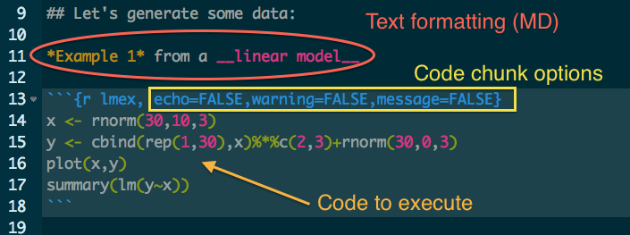
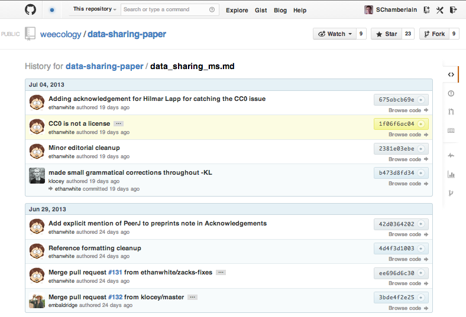

## What you'll learn

> + Markdown 
  + A language for text to html conversion with simple formatting tags that leave you with readable text.
  + Super simple to learn
  + Widely supported (GitHub, pandoc, static webpages, etc..)
> + knitr
  + a simple way to write reproducible documents including R code blocks and formatted text

### What we'll demonstrate
> + git
  + A version control system that allows for collaboration on text documents
  

---

## Markdown use cases

Why would you want to use Markdown?

> + Taking notes
> + Blog posts
> + Research paper
> + MD is used in many places (StackOverflow, Github, etc.), so good to learn it

---

## Markdown - Syntax

> + Headings (#, =, or -)
  + Heading 3 (###)
> + Blockquote (>)
> + Lists
  + Create list using *, +, or -, or ordered list using 1., 2., etc.
  + Nested lists, and more, see the MD site
> + Code blocks
  + Indent 1 tab or 4 spaces
> + Emphasis
  + __Bold__ \*\*bold\*\* or \_\_bold\_\_
  + _Italic_ *italic* or \_italic\_
  + In the middle of a world: un\*\*believe\*\*able
> + Links, like this => []() or [][] with []: url somewhere else
> + You can always just write html!

---

## Markdown - your turn

<i class="icon-exclamation-sign"></i> Exercizes

Create something in MD and view it.  Try and hit as many stylistic elements as possible.  If you're uninspired copy this.

---

## Markdown
### Reasons Scott loves MD

Lists of course! _Ordered_ 
    	
1. I am a destroyer
2. of entropy!

and **Un...**
* I am a child of CHAOS
* `in code blocks`

Easy code for links to [awesome webpages](http://schamberlain.github.io), Oh and images anyone?!


---

## knitr - R code blocks in Markdown

Put executable code blocks in your markdown


```r
foo <- function() {
    print("bar")
}

foo()
```

```
## [1] "bar"
```


Sweet! <i class="icon-thumbs-up-alt"></i>

---
## Anatomy of a code chunk

<center></center>

---
## Markdown - your turn again, with code this time

<i class="icon-exclamation-sign"></i> Exercise

1. Write markdown with code in code blocks without executing the code. 

2. Now, put your markdown text w/code blocks in R, and compile document using knitr, like 


```r
library(knitr)
knit("/path/to/your/file")
```


---

## Why git? Who did what?


---

## Why git? Visualize contributions



---

## git - your turn

> + If you have git installed:
  + Create a folder `foo <- bar(the = 5)`
  + Create a document inside that folder with some markdown text `touch mydoc.md`
  + Initiate the git repo `git init`
  + Tell git to track your file `git add .` or `git add mydoc.md`
  + Commit those changes `git commit -a -m 'initial commit, added mydoc file'`
  + Make some additional changes to your file
  + Commit those changes `git commit -a -m 'edited mydoc file'`
  + Create a branch `git branch newbranch` then `git checkout newbranch`
  + Make a few changes to the file on the new branch and commit `git commit -a -m '...'`
  + Merge the new branch into the master branch `git checkout master` & `git merge newbranch`

---

## Resources for Markdown and git, via FAQ

> + Markdown
  + How do I write Markdown? See [here](http://daringfireball.net/projects/markdown/)
  + How do I ...
> + git 
  + How do I use git? See [here](http://git-scm.com/book)
  + But, I want to watch videos! Okay, see [here](https://www.youtube.com/channel/UCP7RrmoueENv9TZts3HXXtw)
  + How do I ...
